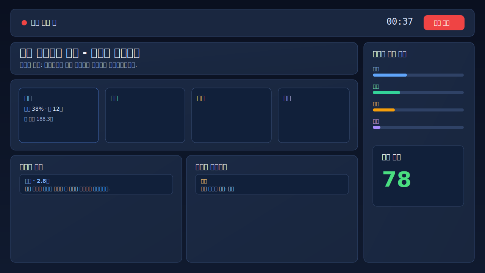
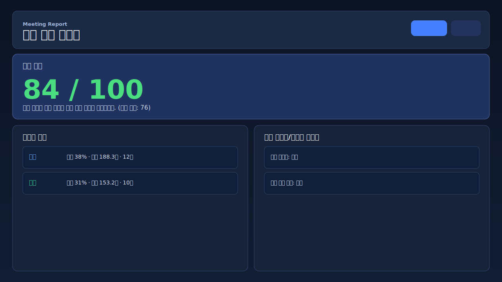

# MeetingReferee Prototype

요구명세서(v1.0) 기반 프로토타입입니다. 현재는 **Deepgram 실시간 연동 전용**으로 동작합니다.

## UI Preview
### 실시간 모니터링


### 종료 리포트


## Demo Flow
1. 회의 시작 클릭
2. 마이크 권한 허용
3. 실시간 자막/화자 지분/이벤트 타임라인 확인
4. 회의 종료 후 리포트 생성 및 JSON 내보내기

## 사전 준비 (로그인 필요)
Deepgram 실시간 연동을 쓰려면 아래가 필요합니다.

1. Deepgram 계정 로그인
2. API Key 발급
3. 프로젝트 루트에 `.env` 생성 후 키 설정

```bash
DEEPGRAM_API_KEY=dg_your_api_key_here
```

## 실행 방법
로컬 API(`/api/deepgram/token`)가 필요하므로 아래 서버로 실행하세요.

```bash
node server.js
```

브라우저에서 `http://localhost:8080` 접속 후 회의를 시작하면 Deepgram 실시간 모드로 동작합니다.

참고:
- 키에 `/v1/auth/grant` 권한이 없으면 `ALLOW_BROWSER_API_KEY_FALLBACK=true`일 때 브라우저 WebSocket 인증으로 자동 대체됩니다(로컬 개발용).

## 포함 기능
- Deepgram WebSocket 실시간 STT + diarization 연동
- 마이크 입력 PCM(16kHz, mono, linear16) 스트리밍
- 화자별 발언 시간/지분/횟수 집계
- 발언 독점/침묵/비효율 패턴 감지
- 회의 종료 리포트 생성 및 JSON 내보내기

## 주요 파일
- `index.html`: 화면 구조
- `styles.css`: UI 스타일
- `app.js`: 상태 관리, 지표 계산, 렌더링, Deepgram 연동 흐름
- `deepgramAdapter.js`: mock + 실시간 Deepgram 스트림 어댑터
- `server.js`: 정적 파일 서빙 + Deepgram 임시 토큰 발급 API

## 트러블슈팅
- `토큰 발급 실패`: `.env`의 `DEEPGRAM_API_KEY` 확인
- `마이크 권한 오류`: 브라우저 권한 허용 및 `localhost` 접속 확인
- `연동 실패`: UI 상태 메시지 확인 (토큰/API key/네트워크/권한 확인)
