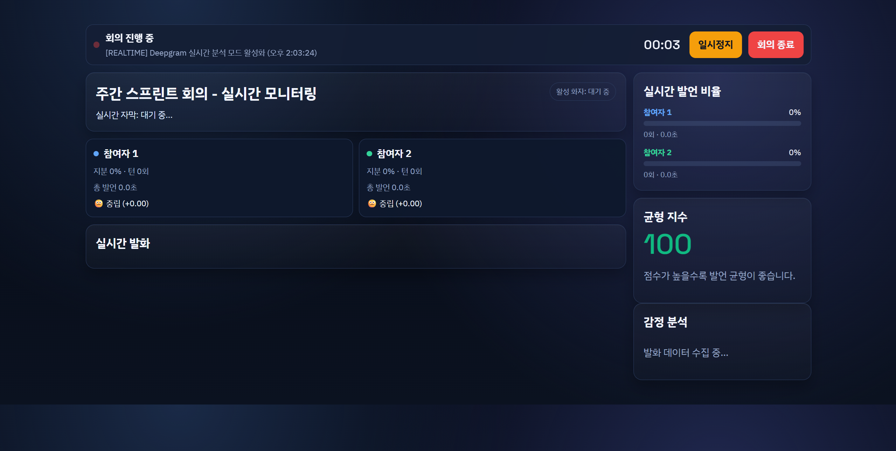
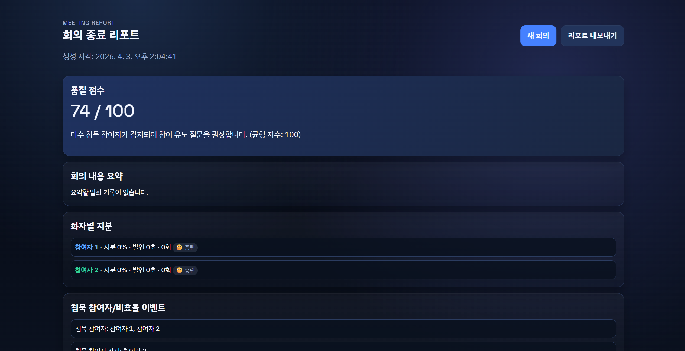

<div align=center>
    
</div>

# MeetingReferee

Deepgram 실시간 STT 및 화자 분리(diarization) API를 활용해 회의 품질을 모니터링하는 단일 페이지 애플리케이션(SPA)입니다. 회의 중 발언 독점, 침묵 참여자, 비효율적 커뮤니케이션 패턴을 실시간으로 감지하고, 회의 종료 후 Claude API를 통한 회의 내용 요약 리포트를 제공합니다.

## UI Preview

### 실시간 모니터링


### 종료 리포트


## Demo Flow

1. 로비에서 회의 제목 및 참여자 수 입력
2. 회의 시작 → 마이크 권한 허용
3. 실시간 자막, 화자별 발언 비율, 감정 분석 확인
4. 이벤트 발생 시 브라우저 알림(토스트) 수신
5. 회의 종료 → Claude API 기반 회의 내용 요약 포함 리포트 생성 및 Markdown 내보내기

## 사전 준비

### 1. API Key 발급

- **Deepgram**: [deepgram.com](https://deepgram.com) 계정 로그인 후 API Key 발급
- **Anthropic**: [console.anthropic.com](https://console.anthropic.com) 계정 로그인 후 API Key 발급 (회의 요약 기능용)

### 2. 환경변수 설정

프로젝트 루트에 `.env` 파일을 생성합니다.

```bash
cp .env.example .env
```

```bash
DEEPGRAM_API_KEY=dg_your_api_key_here    # 필수 - 실시간 STT
ANTHROPIC_API_KEY=sk-ant-your_api_key_here # 필수 - 회의 내용 요약
PORT=8080                                  # 선택 - 서버 포트 (기본값: 8080)
HOST=::                                    # 선택 - 바인딩 주소
```

## 실행 방법

```bash
node server.js
```

브라우저에서 `http://localhost:8080` 접속 후 회의를 시작합니다.

> 참고: 키에 `/v1/auth/grant` 권한이 없으면 `ALLOW_BROWSER_API_KEY_FALLBACK=true` 설정 시 브라우저 WebSocket 인증으로 자동 대체됩니다(로컬 개발용).

## 포함 기능

- Deepgram WebSocket 실시간 STT + 화자 분리(diarization) 연동
- 마이크 입력 PCM(16kHz, mono, linear16) 스트리밍
- 파일 업로드 테스트 모드 (사전 녹음 오디오 분석)
- 화자별 발언 시간/지분/횟수/감정 분석 집계
- 발언 독점/침묵/비효율 패턴 감지 및 끼어들기 감지
- 이벤트 발생 시 브라우저 알림(토스트/Notification API) 통지
- Claude API 기반 회의 내용 자동 요약
- 회의 종료 리포트 생성 및 Markdown 내보내기

## 주요 파일

| 파일 | 설명 |
|------|------|
| `index.html` / `lobby.js` | 로비 페이지 (회의 설정 입력) |
| `dashboard.html` / `dashboard.js` | 실시간 모니터링 대시보드 |
| `report.html` / `report.js` | 회의 종료 리포트 (요약 포함) |
| `deepgramAdapter.js` | Deepgram WebSocket 클라이언트 (오디오 처리) |
| `server.js` | 정적 파일 서빙 + API 엔드포인트 |
| `styles.css` | 다크 테마 UI 스타일 |

## API 엔드포인트

| 메서드 | 경로 | 설명 |
|--------|------|------|
| `GET` | `/api/health` | 서버 상태 확인 |
| `POST` | `/api/deepgram/token` | Deepgram 임시 토큰 발급 |
| `POST` | `/api/deepgram/prerecorded` | 사전 녹음 오디오 전사 |
| `POST` | `/api/summarize` | Claude API 회의 내용 요약 |

## 트러블슈팅

- **토큰 발급 실패**: `.env`의 `DEEPGRAM_API_KEY` 확인
- **마이크 권한 오류**: 브라우저 권한 허용 및 `localhost` 접속 확인
- **회의 요약 실패**: `.env`의 `ANTHROPIC_API_KEY` 확인
- **연동 실패**: UI 상태 메시지 확인 (토큰/API key/네트워크/권한 확인)
